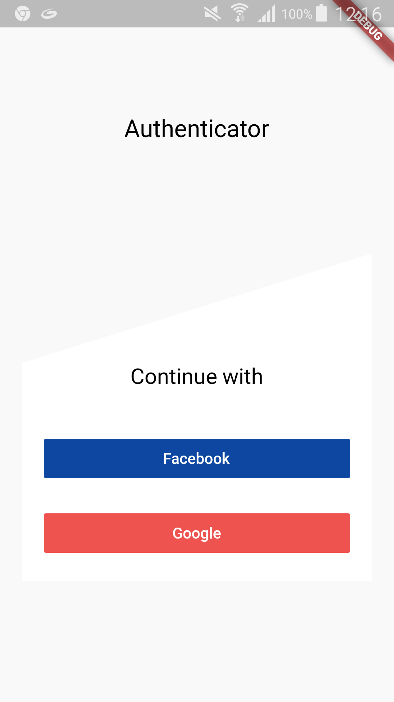
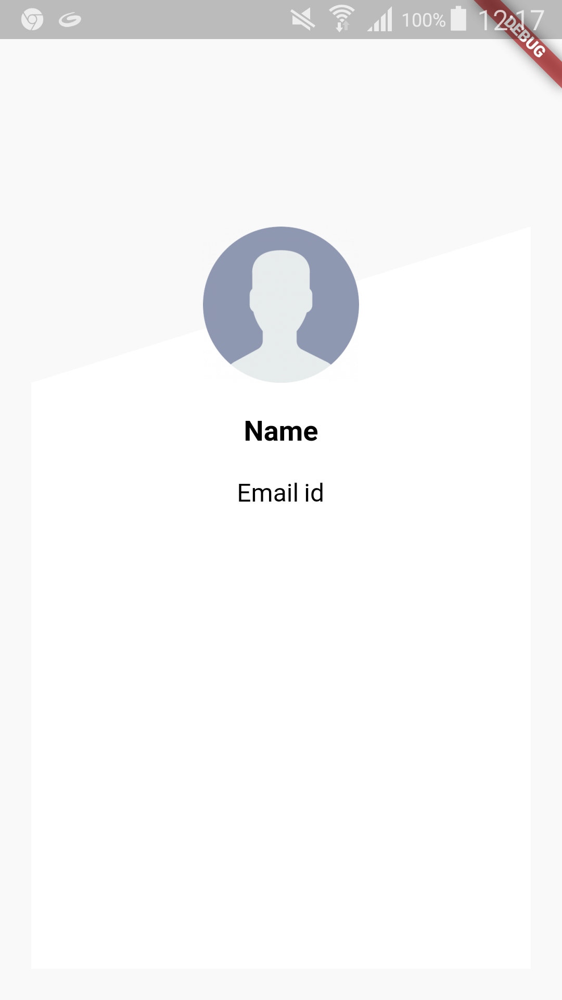

# firebase_authenticator

Create a new user or login an existed one with Facebook and Google in Firebase.

## How to use this sample:
1. You need to create a app in `Facebook developer console` and in `Firebase console`.
1. Add `google_services.json` file from the Firebase inside `app` folder.
2. Add your `facebook_app_id` and `fb_login_protocol_scheme` inside `strings.xml` file located at `/app/src/main/res/values/strings.xml`.

## Screenshots:

