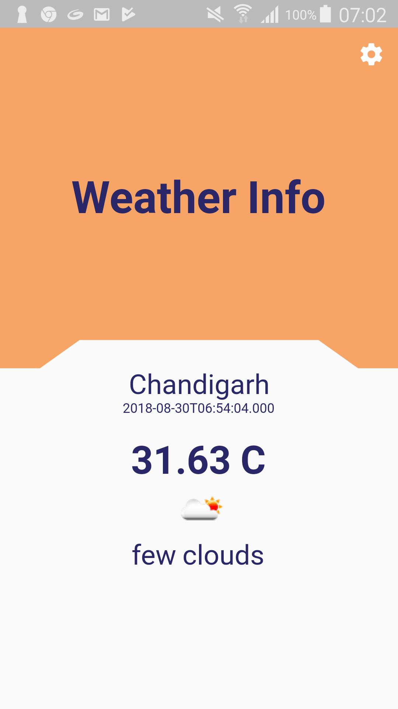
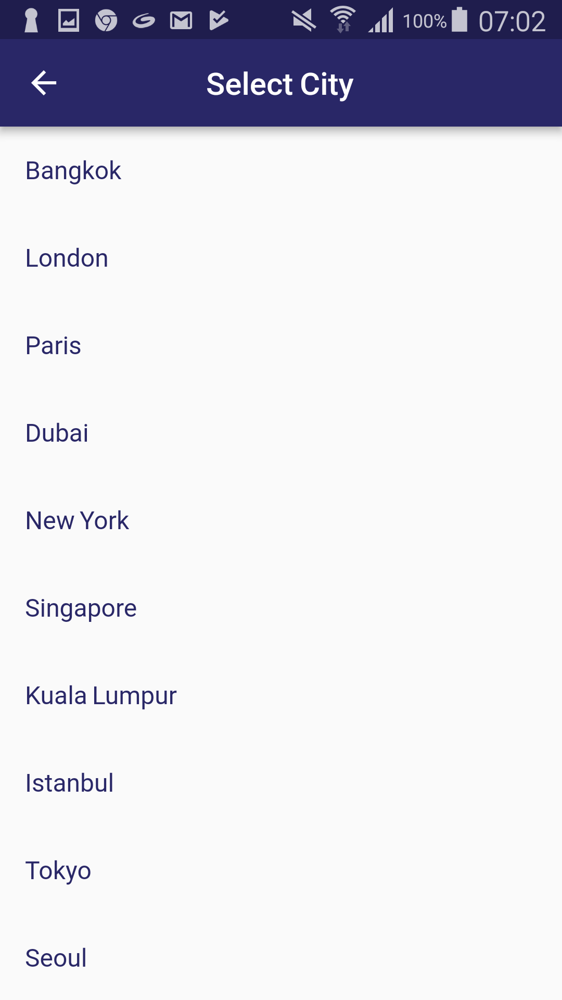
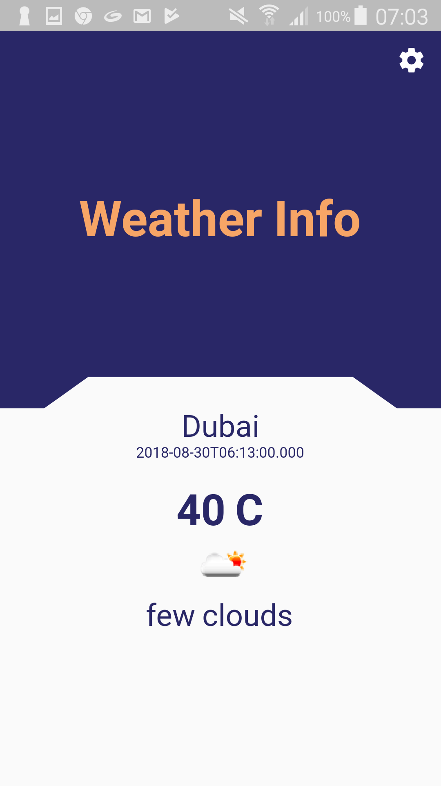

# weather_app

Get the weather info from the API. http://api.openweathermap.org

## Usage

1. Get you AppId or key from http://api.openweathermap.org
2. Add that key in `constants.dart` file.

## Screenshots

